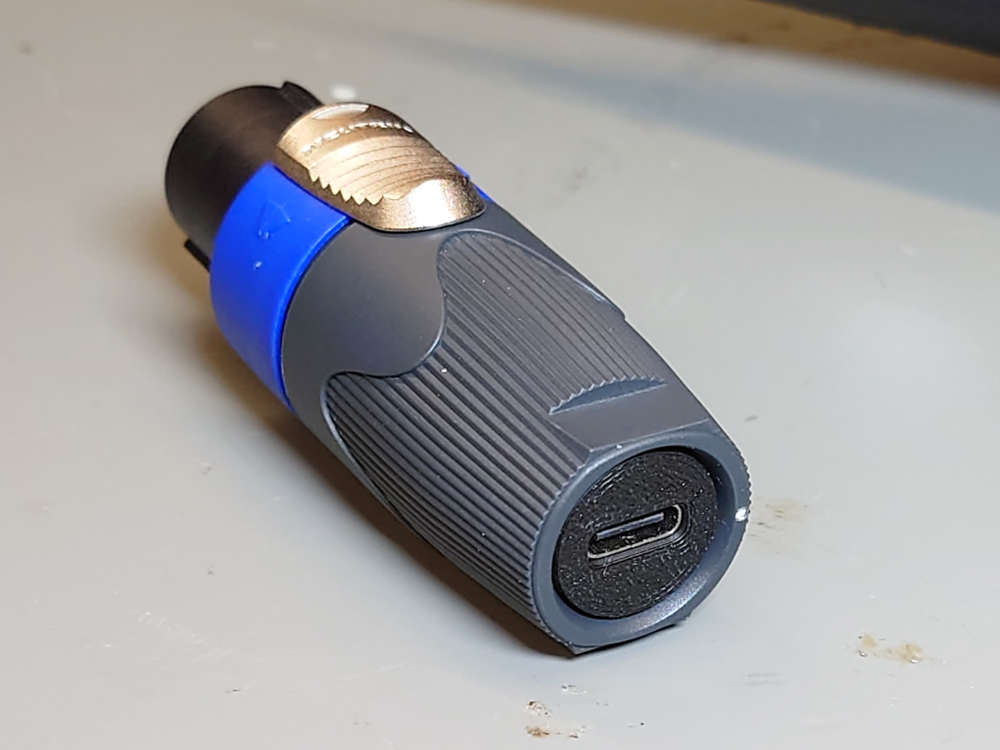
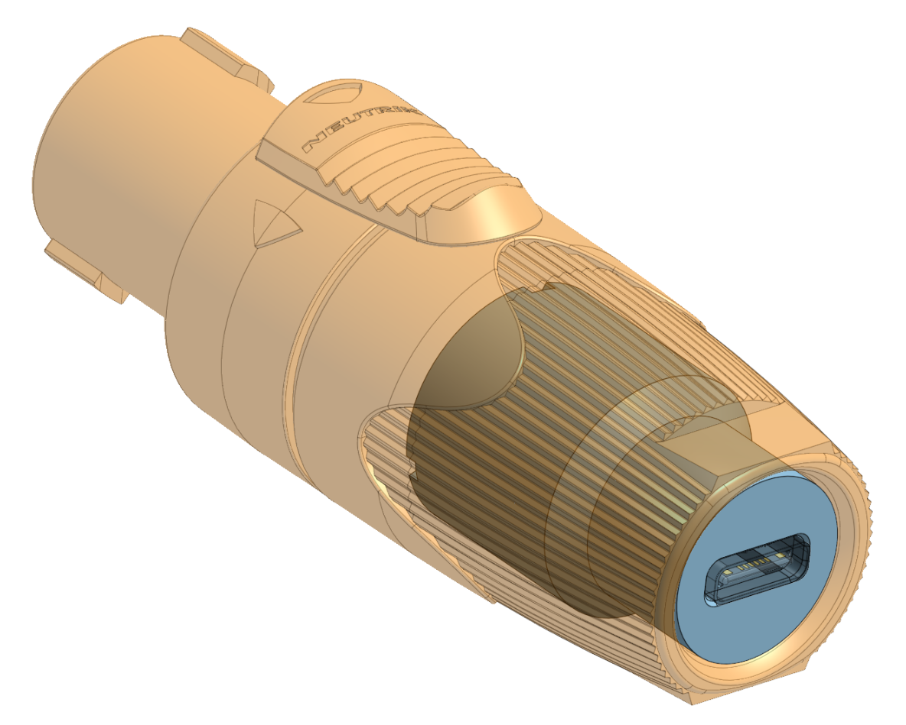
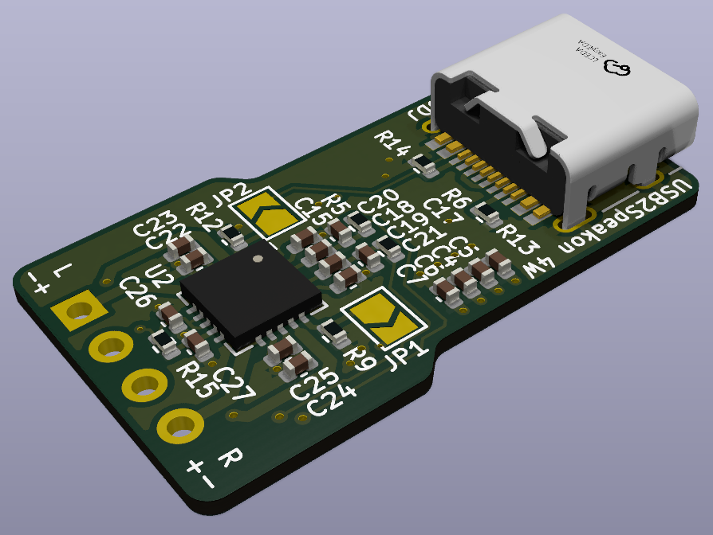
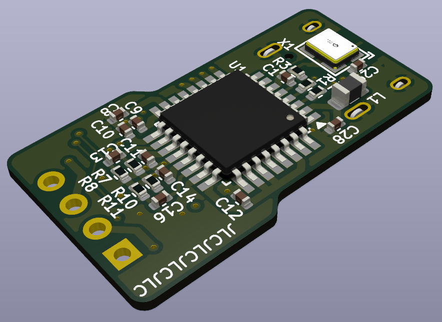
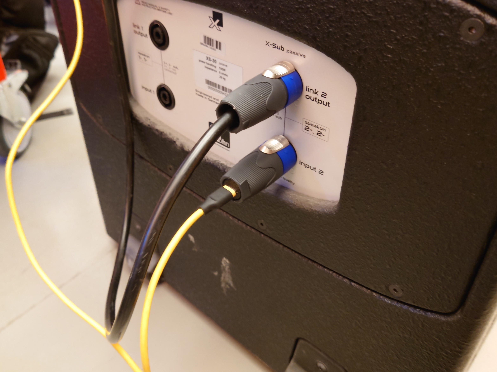

# USB2Speakon

A fully self contained, USB powered ~5W PMPO[^1] Class-D amplifier inside a Speakon connector.  
This adapter allows you to connect your phone / laptop / $USB-audio-host-capable device to any passive loudspeaker that accepts a Speakon plug.  
In my tests it reached volumes significantly above "room volume". Its output power is probably enough to host a small indoor party.

> [!WARNING]
> It's not recommended to reproduce this project in the current state, as v0.1 contains some issues and v0.2 is not yet tested.  
> Here be dragons.

  &nbsp;
  &nbsp;
  &nbsp;
  &nbsp;

### 3D-Printed Insert
The mechanical dimensions of the PCB and the insert were designed for a (now discontinued) [Neutrik speakON NL4FX](https://www.neutrik.com/en/product/nl4fx). 

The .step file can be found in the root of the repo and [the full design is on OnShape](https://cad.onshape.com/documents/68748694b7ef2772d9eb6de5/w/d122b393e16d1d6e538e0f7c/e/8ff2a0b1ab0e743580e4e000).

## Known "issues"
(Not really issues, as this project is more of an irl shitpost, so any issues are more or less by design :D)
- Android phones produce less volume than PCs. Idk why exactly, but it appears to be a software limitation, it's not limited by USB power. 
  - On some Android phones it's way too quiet though, there you can use [this shady volume booster app](https://play.google.com/store/apps/details?id=com.goodev.volume.booster) that actually manages to increase the output volume in that case.
- The project was designed for the now discontinued NL4FX. It is unclear if it would mechanically fit inside the new NL4FXX.
- v0.1 has a 3225 footprint for a 6MHz crystal. No 6MHz crystal is available for that footprint tho.

## Pictures in use

[^1]: ~~Peak Music Power Output~~ Panel Melting Power Once